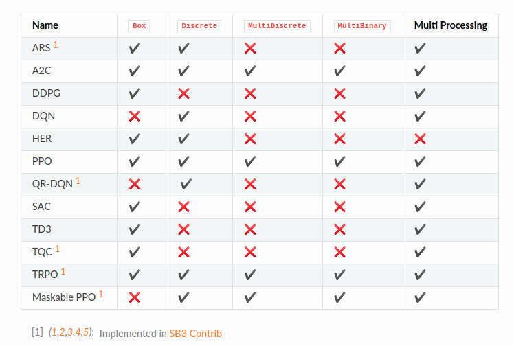

Box: A N-dimensional box that contains every point in the action space.

Discrete: A list of possible actions, where each timestep only one of the actions can be used.

MultiDiscrete: A list of possible actions, where each timestep only one action of each discrete set can be used.

MultiBinary: A list of possible actions, where each timestep any of the actions can be used in any combination.
